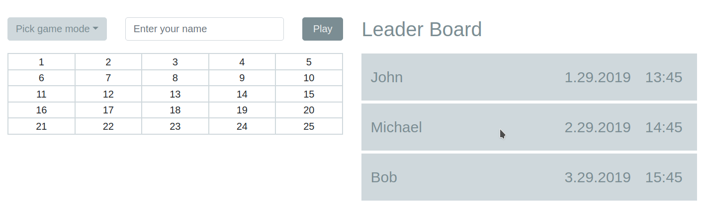

<h1 align="center">
  Game in dots
</h1>




## 🍔 Install project

1.  **Fetch project**

    Use git to fetch project on you local machine.

    ```sh
    git clone https://github.com/lsarkisov/Game-In-Dots.git
    ```

3.  **Start runing project.**

    Navigate into your new site’s directory and start it up. The project will be running on port `3000`

    ```sh
    cd <Game-In-Dots>
    npm i
    npm start
    ```
    The project will open on [http://localhost:3000/](http://localhost:3000/)
   

## 🙈 Crucial files?

A quick look at the top-level files and directories you'll see in the project.

.
├── actions
│   ├── game-modes
│   │   └── index.js
│   ├── game-play
│   │   └── index.js
│   ├── leader-board
│   │   └── index.js
│   └── user-name
│       └── index.js
├── assets
│   └── css
│       ├── _base.scss
│       ├── _colors.scss
│       └── styles.scss
├── components
│   ├── app
│   │   ├── index.js
│   │   └── _styles.scss
│   ├── game-board
│   │   ├── index.js
│   │   ├── square.js
│   │   └── _styles.scss
│   ├── game-mode
│   │   ├── index.js
│   │   └── _styles.scss
│   ├── leader-board
│   │   ├── index.js
│   │   └── _styles.scss
│   └── user-name
│       ├── index.js
│       └── _styles.scss
├── const
│   ├── api.js
│   └── index.js
├── containers
│   ├── app
│   │   └── index.js
│   ├── game-board
│   │   └── index.js
│   ├── game-mode
│   │   └── index.js
│   └── leader-board
│       └── index.js
├── index.js
├── reducers
│   ├── game-modes
│   │   └── index.js
│   ├── game-play
│   │   └── index.js
│   ├── index.js
│   ├── leader-board
│   │   └── index.js
│   └── user-name
│       └── index.js
├── sagas
│   ├── all
│   │   └── index.js
│   └── index.js
├── services
│   └── api.js
├── store
│   └── index.js
└── utils
    └── index.js